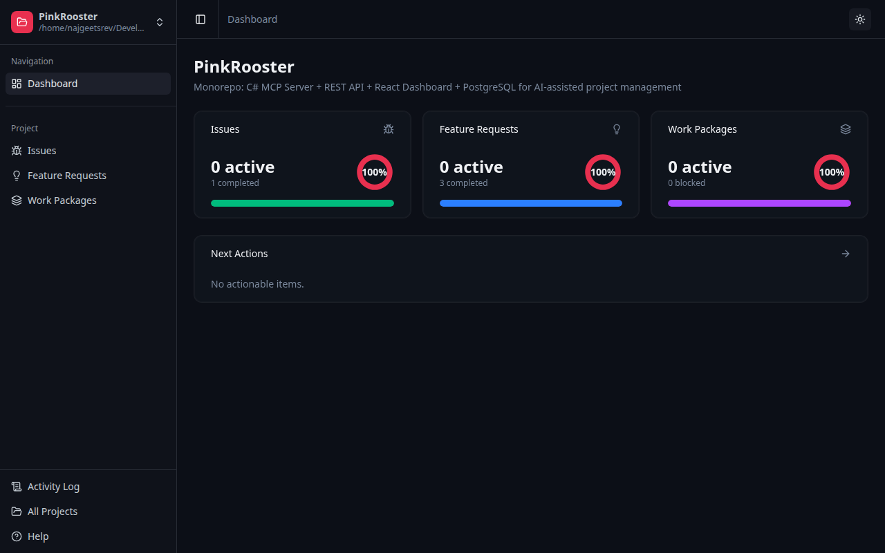
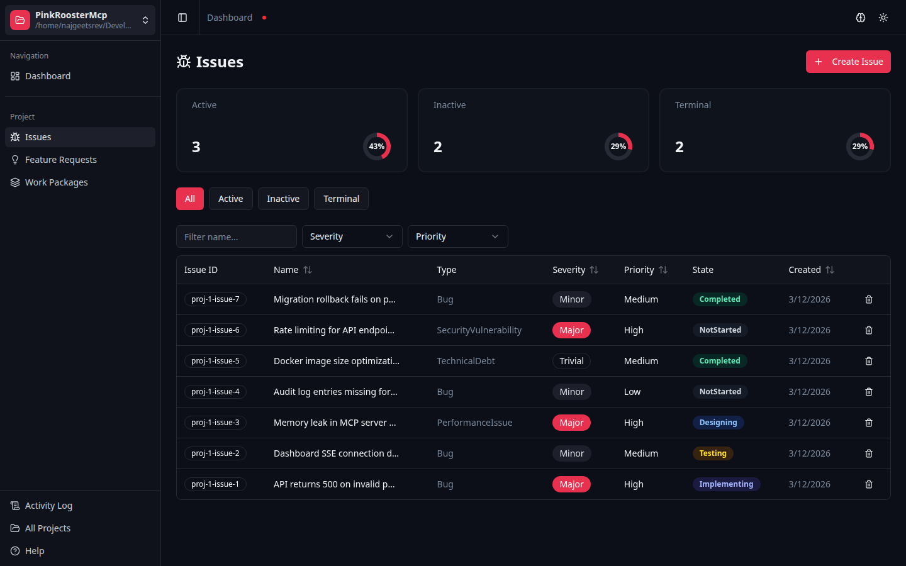
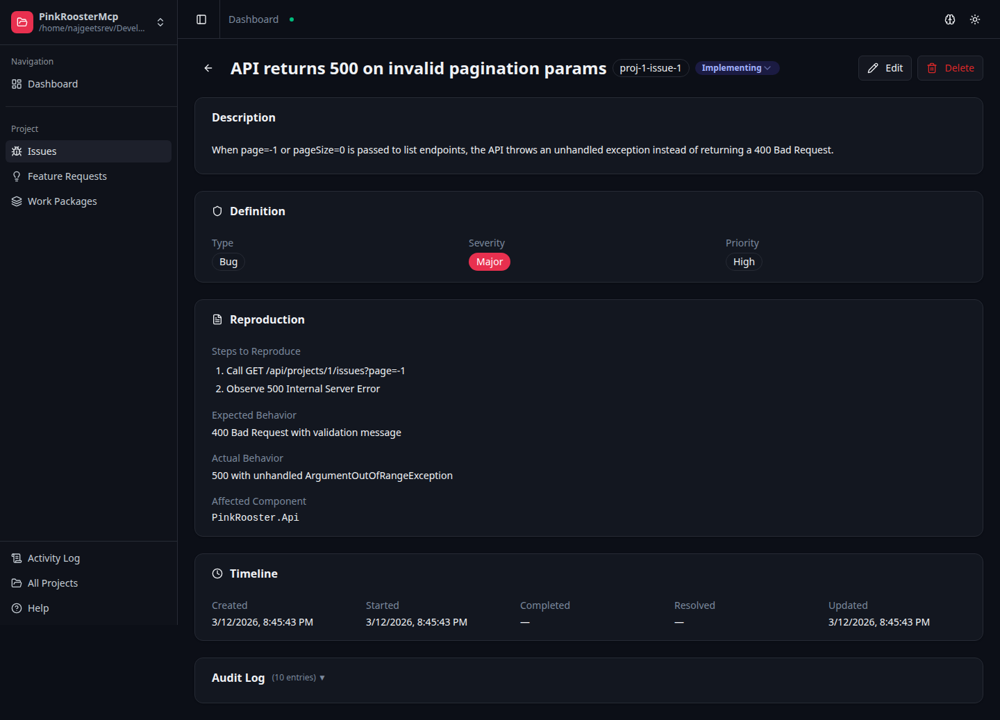
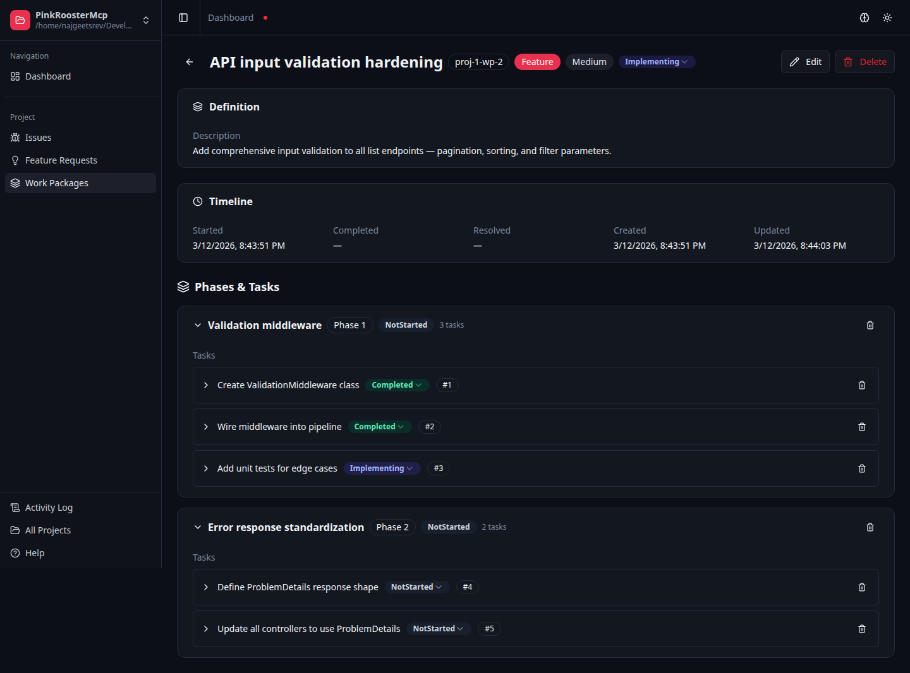
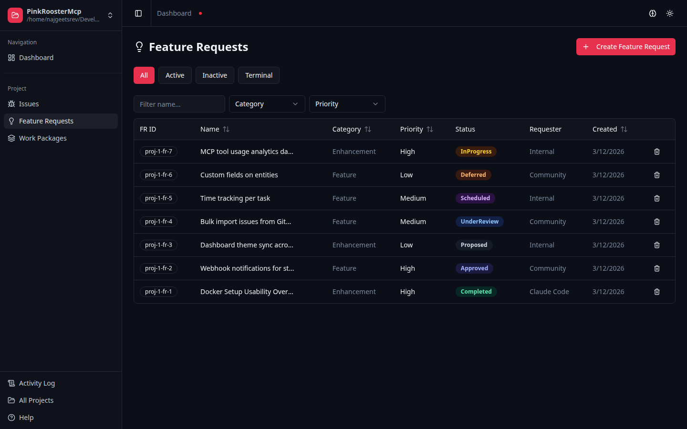
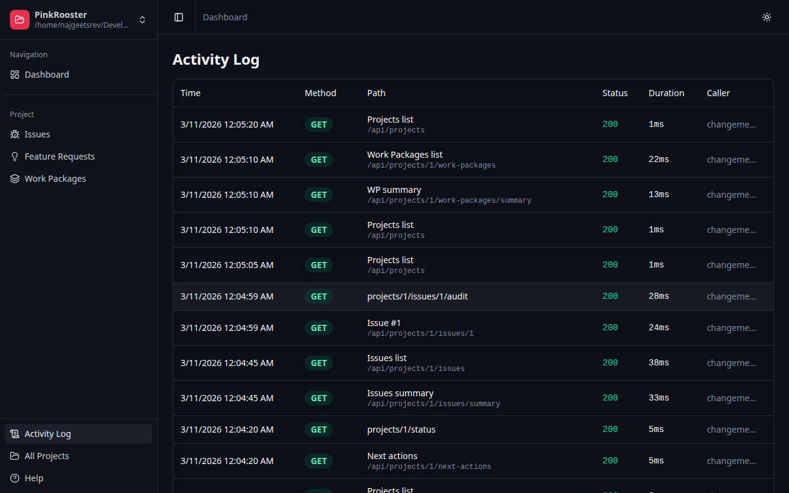
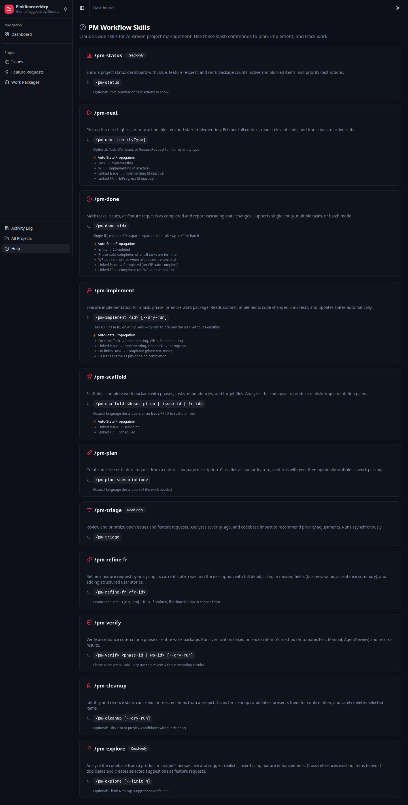

<div align="center">


# PinkRoosterMcp

**Project management that thinks in code, not tickets.**

The first project management system built from scratch for AI coding agents — not a wrapper around Jira or Linear.

[](LICENSE)
[](https://dotnet.microsoft.com/)
[](https://modelcontextprotocol.io/)
[](https://hub.docker.com/r/pinkrooster/pinkroostermcp)
[]()

[Quick Start](#quick-start) · [Why PinkRooster?](#why-pinkrooster) · [Dashboard](#dashboard) · [MCP Tools](#mcp-tools) · [PM Skills](#pm-workflow-skills) · [Getting Started](#getting-started)

</div>

---

## Quick Start

```bash
git clone https://github.com/pinkroosterai/PinkRoosterMcp.git
cd PinkRoosterMcp
make install
```

That's it. `make install` pulls the pre-built image from Docker Hub, registers the MCP server in Claude Code, installs PM skills, and starts all containers. No accounts, no configuration, no build step.

Dashboard at [localhost:3000](http://localhost:3000) · API at [localhost:5100](http://localhost:5100) · MCP at [localhost:5200](http://localhost:5200)

---

## Why PinkRooster?

Every other PM-related MCP server is a wrapper around an existing SaaS product. PinkRoosterMcp is **purpose-built for AI agents** — the data model, response format, and workflow skills are designed for AI consumption first, with a dashboard for human visibility.

### The Problem

```
Traditional workflow:
  1. Open browser → find Jira ticket → read requirements
  2. Switch to IDE → write code → run tests
  3. Switch to browser → update ticket status → add comment
  4. Repeat 50x per day
```

### The PinkRooster Workflow

```
  You: /pm-next --auto
  Agent: picks highest priority work → scaffolds plan → implements code →
         runs tests → commits → updates all project state → picks next item →
         repeats until done
  You: ☕
```

### How It Compares

| | PinkRoosterMcp | Jira + MCP Wrapper | Linear + MCP Wrapper |
|---|---|---|---|
| **Built for AI agents** | From scratch | Bolt-on API wrapper | Bolt-on API wrapper |
| **Self-hosted** | Single Docker image | SaaS only | SaaS only |
| **Setup time** | 1 command | Account + OAuth + config | Account + API key + config |
| **State cascades** | Automatic (5 levels deep) | Manual updates | Manual updates |
| **Work breakdown** | Agent scaffolds from description | You write every ticket | You write every ticket |
| **Multi-user RBAC** | Built-in (4 roles, per-project) | Org-level permissions | Workspace roles |
| **Project memories** | Built-in cross-session context | None | None |
| **Autonomous mode** | `/pm-next --auto` | None | None |
| **Token-optimized responses** | Purpose-built for agents | Verbose human-facing payloads | Verbose human-facing payloads |
| **Cost** | Free (MIT) | $8-16/user/month | $8-16/user/month |

---

## Features at a Glance

### Automatic State Cascades

Complete a task and everything upstream updates automatically — no manual ticket grooming:

```
Task completed
  └→ Phase auto-completes (all tasks done)
       └→ Work Package auto-completes (all phases done)
            ├→ Linked Issue auto-resolved
            └→ Linked Feature Request auto-completed
```

Dependencies auto-block and auto-unblock. The agent always knows what happened downstream via structured `OperationResult` responses with state change notifications.

### Autonomous Implementation Loop

A single command drives the full development lifecycle:

```
/pm-next --auto
```

The agent picks the highest-priority work item, scaffolds a plan if needed, implements every task (reading code, writing changes, running tests), commits after each work package, and loops until all work is done.

### 24 MCP Tools

Every tool is designed for AI consumption — compact responses, actionable next steps, and state cascade notifications. Scaffold an entire work package with phases, tasks, and dependencies in a single call.

### 16 PM Workflow Skills

High-level slash commands that encode sophisticated PM workflows: `/pm-scaffold` analyzes your codebase to produce realistic target files and implementation notes. `/pm-implement` handles dependency ordering, test running with auto-fix, and phase verification gates. `/pm-audit` runs parallel analysis agents across quality, security, performance, and architecture domains. `/pm-cleanup` finds dead code and scaffolds fix tasks.

### Project Memories

Persistent knowledge store for decisions, patterns, and context that survives across agent sessions. Merge-by-name semantics — writing to an existing memory appends content and unions tags.

### Human-Readable IDs

`proj-1-issue-3`, `proj-1-wp-2-task-5` — readable by both agents and humans in conversation. No GUIDs, no opaque numeric IDs.

### Multi-User Accounts & Per-Project RBAC

Built-in user account system with Argon2id password hashing, session management, and per-project role-based access control. Four roles (SuperUser, Admin, Editor, Viewer) give fine-grained control over who can do what on each project. First user auto-gets SuperUser. API key auth for MCP/programmatic access runs in parallel — no RBAC overhead for agents.

### Full Observability

Two layers of audit: per-entity field-change audit logs (old/new values on every field) and HTTP request activity logging (method, path, status, duration, caller). The dashboard surfaces both.

---

## Dashboard

A real-time React dashboard lets you see everything your AI agent is tracking — at a glance or in full detail.

### Project Overview

The dashboard home shows active counts, completion percentages, and priority next actions across all entity types.

<div align="center">

</div>

### Issue Tracking

Filter and sort issues by severity, priority, type, and state. Summary cards show active/inactive/terminal breakdowns with mini donut charts.

<div align="center">

</div>

### Rich Detail Pages

Every entity has a structured detail page with inline editing, state management, related entities, timeline, and a collapsible audit log.

<div align="center">

</div>

### Work Packages

Work packages are the execution unit — each one contains phases and tasks with dependency tracking and automatic state propagation.

<div align="center">

</div>

### Feature Requests

Track ideas from proposal through completion with an 8-state lifecycle. Link feature requests to work packages to connect "what" to "how."

<div align="center">

</div>

### Activity Log

Every API request is logged with method, path, status, duration, and caller identity — giving you full observability into agent behavior.

<div align="center">

</div>

---

## How It Works

```
┌─────────────────┐     MCP (Streamable HTTP)     ┌─────────────────┐
│  Claude Code /  │ ◄──────────────────────────► │   MCP Server    │
│  Cursor / etc.  │                                │   :5200         │
└─────────────────┘                                └────────┬────────┘
                                                            │ HTTP
┌─────────────────┐          HTTP / REST           ┌────────▼────────┐
│   Dashboard     │ ◄──────────────────────────► │   REST API      │
│   :3000         │                                │   :5100         │
└─────────────────┘                                └────────┬────────┘
                                                            │ EF Core
                                                   ┌────────▼────────┐
                                                   │   PostgreSQL    │
                                                   │   :5432         │
                                                   └─────────────────┘
```

**Key design decisions:**
- The MCP server calls the API over HTTP — no shared database access, clean separation
- Human-readable IDs everywhere (`proj-1-issue-3`, `proj-1-wp-2-task-5`) — easy for both agents and humans
- State cascades automatically — completing all tasks in a phase completes the phase, which can complete the work package, which can complete linked issues and feature requests
- Full audit trail — every field change is recorded with old/new values

---

## Entities

| Entity | Purpose | States |
|--------|---------|--------|
| **Project** | Top-level container, identified by filesystem path | Active |
| **Issue** | Bugs, defects, regressions, tech debt, performance, security | NotStarted → Designing → Implementing → Testing → InReview → Completed |
| **Feature Request** | Ideas and enhancements with business context | Proposed → UnderReview → Approved → Scheduled → InProgress → Completed |
| **Work Package** | Execution plan with phases, tasks, and dependencies | Same as Issue + automatic upward propagation |
| **Phase** | Grouping of related tasks within a work package | Auto-completes when all tasks reach terminal state |
| **Task** | Atomic unit of work with target files | Same states as Issue, supports dependency blocking |
| **Project Memory** | Stored knowledge, decisions, patterns, and context | Stateless (no lifecycle) |
| **User** | Multi-user accounts with Argon2id password hashing | Active / Inactive (soft delete) |
| **User Project Role** | Per-project role assignment (Admin, Editor, Viewer) | — |

---

## MCP Tools

PinkRoosterMcp exposes 24 MCP tools organized by entity:

| Tool | Description |
|------|-------------|
| `get_project_status` | Compact status dashboard — counts, active/blocked items |
| `get_next_actions` | Priority-ordered actionable items with enriched context (linked entity names, complexity) |
| `create_or_update_issue` | Create or update issues with full field support |
| `get_issue_details` / `get_issue_overview` | Read issue data |
| `create_or_update_feature_request` | Create or update feature requests |
| `get_feature_request_details` / `get_feature_requests` | Read feature request data |
| `manage_user_stories` | Add, update, or remove structured user stories on feature requests |
| `create_or_update_work_package` | Create or update work packages |
| `get_work_package_details` / `get_work_packages` | Read work package trees |
| `scaffold_work_package` | One-call creation of WP + phases + tasks + dependencies |
| `create_or_update_phase` / `create_or_update_task` | Manage phases and tasks (phase supports batch task creation) |
| `batch_update_task_states` | Update multiple task states in one call with consolidated cascades |
| `verify_acceptance_criteria` | Record verification results for phase acceptance criteria |
| `manage_dependency` | Add/remove WP or task dependencies with auto-block (auto-detects from ID format) |
| `list_memories` / `get_memory_details` | Read project memories (filter by name pattern or tag) |
| `create_or_update_memory` | Create or merge memory by name (append content, union tags) |
| `delete_memory` | Permanently delete a project memory |
| `delete_entity` | Permanently delete an entity by type with cascade handling |

All write operations return structured `OperationResult` JSON with state change cascades, so the agent always knows what happened downstream.

---

## PM Workflow Skills

Sixteen Claude Code slash commands provide high-level project management workflows on top of the MCP tools:

| Command | What it does |
|---------|-------------|
| `/pm-status` | Show project dashboard with counts, blocked items, and next actions |
| `/pm-next [--auto]` | Pick the highest-priority item and start implementing. `--auto` loops until done |
| `/pm-done <id>` | Mark entity completed, report all cascades |
| `/pm-implement <id>` | Full implementation loop — read context, write code, run tests, update state |
| `/pm-scaffold <desc\|id>` | Scaffold a work package from a description or linked issue/FR |
| `/pm-plan <desc>` | Create an issue or FR from natural language, optionally scaffold |
| `/pm-triage` | Analyze and prioritize open items |
| `/pm-refine-fr <fr-id>` | Refine a feature request — rewrite description, add user stories, fill gaps |
| `/pm-explore [--limit N]` | Analyze codebase as a PM and suggest user-facing features |
| `/pm-verify <id>` | Verify acceptance criteria for a phase or work package |
| `/pm-cleanup [--dry-run]` | Analyze codebase for dead code and debt, scaffold a cleanup work package |
| `/pm-codesmells` | Scan for code smells using threshold-based metrics — long methods, god classes, deep nesting, and more |
| `/pm-housekeeping [--dry-run]` | Delete stale, cancelled, rejected, or replaced project entities |
| `/pm-brainstorm [topic]` | Interactive feature brainstorming via Socratic dialogue and web research |
| `/pm-audit [--focus domain]` | Proactive codebase audit — creates tracked issues from confirmed findings |
| `/pm-troubleshoot` | Diagnose root cause of bugs by tracing code, logs, and git history |

Skills automatically propagate state to related entities. Starting a task activates its work package and linked issue/FR. Completing all tasks cascades completion upward through phases, work packages, and linked entities.

<div align="center">

</div>

---

## Getting Started

### Prerequisites

- [Docker](https://docs.docker.com/get-docker/) and Docker Compose
- [Claude Code](https://docs.anthropic.com/en/docs/claude-code) (recommended — `make install` auto-registers the MCP server)
- [.NET 9 SDK](https://dotnet.microsoft.com/download/dotnet/9.0) and [Node.js 20+](https://nodejs.org/) (for local development only)

### Quick Start

```bash
git clone https://github.com/pinkroosterai/PinkRoosterMcp.git
cd PinkRoosterMcp
make install
```

That's it. `make install` will:
1. Create `.env` with working defaults (no edits needed)
2. Register the MCP server in Claude Code (global scope, skipped if CLI not found)
3. Install PM workflow skills to `~/.claude/skills/`
4. Pull and start the pre-built Docker Hub image (no local build required)

To build from source instead, use `make setup` (same steps but builds the image locally).

Services will be available at:
| Service | URL |
|---------|-----|
| Dashboard | http://localhost:3000 |
| REST API | http://localhost:5100 |
| MCP Server | http://localhost:5200 |
| Swagger | http://localhost:5100/swagger/index.html |

### Deploy with Docker Hub Image

You can run PinkRoosterMcp without cloning the repository by using the pre-built image from Docker Hub.

1. Create a `docker-compose.yml`:

```yaml
services:
  postgres:
    image: postgres:17
    environment:
      POSTGRES_DB: pinkrooster
      POSTGRES_USER: pinkrooster
      POSTGRES_PASSWORD: ${POSTGRES_PASSWORD:-pinkrooster}
    ports:
      - "5432:5432"
    volumes:
      - pgdata:/var/lib/postgresql/data
    healthcheck:
      test: ["CMD-SHELL", "pg_isready -U pinkrooster"]
      interval: 5s
      timeout: 5s
      retries: 5

  pinkrooster:
    image: pinkrooster/pinkroostermcp:latest
    ports:
      - "3000:80"      # Dashboard
      - "5100:8080"    # REST API
      - "5200:8081"    # MCP Server
    environment:
      DATABASE_URL: "Host=postgres;Database=pinkrooster;Username=pinkrooster;Password=${POSTGRES_PASSWORD:-pinkrooster}"
      API_KEY: ${API_KEY:-}
      MCP_API_KEY: ${MCP_API_KEY:-}
    depends_on:
      postgres:
        condition: service_healthy

volumes:
  pgdata:
```

2. Start the services:

```bash
docker compose up -d
```

3. Register the MCP server in Claude Code:

```bash
claude mcp add --transport http --scope user pinkrooster http://localhost:5200
```

To pin a specific version, replace `latest` with a version tag (e.g., `pinkrooster/pinkroostermcp:1.0.1`).

### Connect Your AI Agent

If you ran `make install` with Claude Code installed, the MCP server is already registered. For other MCP clients, point them to `http://localhost:5200` (Streamable HTTP) or `http://localhost:5200/sse` (legacy SSE).

### Developer Setup

For contributors making changes to PinkRoosterMcp:

```bash
make setup-dev    # Install deps, register MCP, start multi-image containers with hot reload
```

Or use local processes with hot reload:

```bash
make dev          # Start PostgreSQL in Docker + API/MCP/Dashboard locally with dotnet watch
make dev-api      # API only (hot reload)
make dev-dashboard # Dashboard only (Vite dev server)
```

### Authentication

**Dashboard**: Multi-user authentication is built in. On first visit, you'll see a registration form — the first user automatically becomes SuperUser. Subsequent users are created via the Users management page and assigned per-project roles (Admin, Editor, Viewer).

**API / MCP**: Optional API key authentication. Everything runs with open access by default. To enable, edit `.env`:

```bash
API_KEY=your-api-key          # API authentication (required by MCP→API calls)
MCP_API_KEY=your-mcp-key      # MCP server authentication (optional, separate from API_KEY)
```

### Troubleshooting

| Problem | Solution |
|---------|----------|
| Port already in use | Stop conflicting services or change ports in `docker-compose.yml` |
| Container unhealthy | Run `make logs` to see error output |
| MCP not registered | Run `claude mcp add --transport http --scope user pinkrooster http://localhost:5200` |
| Database connection error | Ensure PostgreSQL container is healthy: `docker compose ps` |

---

## Testing

```bash
# .NET integration tests (requires Docker for Testcontainers)
dotnet test

# Dashboard frontend tests
cd src/dashboard && npm test
```

700+ tests: 343 API integration tests + 112 unit tests + 255 dashboard frontend tests. 98.3% MCP E2E pass rate across 59 test scenarios.

---

## Tech Stack

| Layer | Technology |
|-------|-----------|
| MCP Server | .NET 9, [ModelContextProtocol SDK](https://github.com/modelcontextprotocol/csharp-sdk) |
| REST API | .NET 9, ASP.NET Core, Argon2id (Konscious.Security.Cryptography) |
| Database | PostgreSQL 17, EF Core 9 |
| Dashboard | React 19, TypeScript, Vite, Tailwind CSS v4, shadcn/ui, TanStack Query/Table, Recharts |
| Testing | xUnit v3, Testcontainers, Respawn, Vitest, React Testing Library, MSW |
| Infrastructure | Docker Compose, nginx |

---

## Contributing

Contributions are welcome! See the [Developer Setup](#developer-setup) section to get started. The project uses `make setup-dev` for the full contributor workflow with hot reload across all services.

---

## License

MIT
